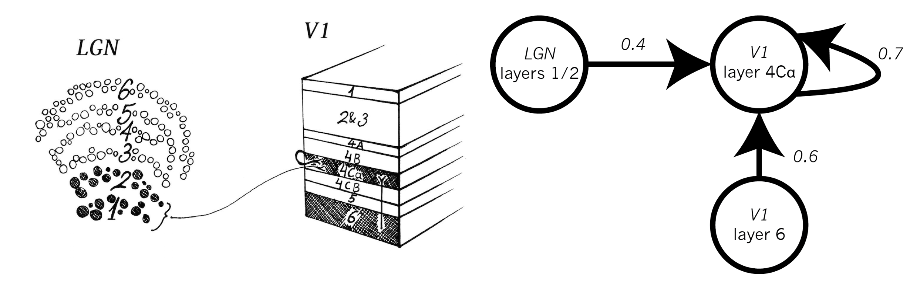
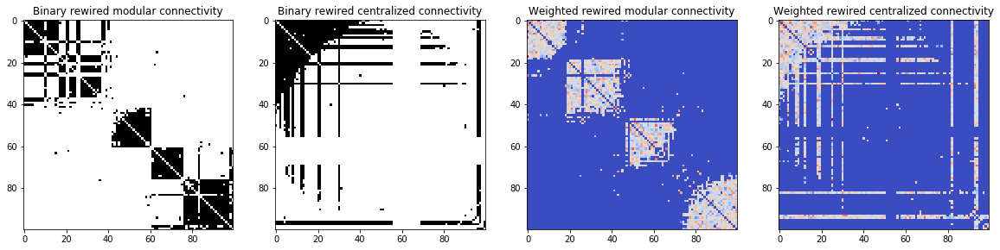

netRewireAnalyze: A package implementing rewiring models and summary metrics on binary and weighted networks 
=================================





**Left** _Schematic anatomical connections of the lateral geniculate nucleus (LGN) and primary visual cortex processing the visual input_

**Right** _Network representation of the anatomical connections with the numbers indicating the strengths of the connection_


I wrote this package while working on a project on adaptive rewiring and learning. The culmination of this effort is a paper that is currently under review (_Adaptive rewiring based on diffusion balances stability and plasticity in weighted networks while evolving ‘brain-like’ structure._ Ilias Rentzeperis, Cees van Leeuwen). My goal was to dig deeper on the rewiring methods and metrics used to characterize the connectivity of the matrices.

This package contains modules that implement the following:
1. Three rewiring models that result in small world networks, for both binary and weighted networks. These are:
- **Heat Diffusion rewiring:** nodes get connected if there is increased flow, disconected when there is not. 
- [Self-organisation of small-world networks by adaptive rewiring in response to graph diffusion](https://www.nature.com/articles/s41598-017-12589-9) 
- **Coupled maps rewiring:** nodes with similar activities connect, the ones with divergent activities disconnect
- [Evolution to a small-world network with chaotic units](https://www.researchgate.net/publication/231032445_Evolution_to_a_small-world_network_with_chaotic_units) 
- **Partially randomized rewiring:** starting with a regular ring lattice you go through all the connections and with probability p you cut the connection and assign it randomly to any node. Seminal work on small world networks by Watts and Strogatz.
- [Collective dynamics of ‘small-world’ networks](https://www.nature.com/articles/30918)         



_Adjacency matrices after 4000 rewirings on an initially randomly connected network. The rewirings are based on the heat diffusion algorithm, the first two adjacency matrices have binary connections (either 0 or 1) and the latter two normally distributed weights. The final connectivity pattern can vary depending on the value of the heat diffusion rate parameter_

2. Summary metrics of the networks that are in the form of adjacency matrices. There are metrics for both binary and weighted undirected networks (symmetric adjacency matrices). The metrics are
- Path length 
- Clustering coefficient
- Small worldness
- Modularity index
- Assortativity
- Rich club

Please note, that while writing this code my first prioritiy was to break it down in an understandable -to myself at least- way. Optimality thus took a back seat, but hopefully functions are not desperately slow.

Prerequisites
-------------

- Python 3+
- scipy
- numpy
- matplotlib


Installation
------------
the package ``netRewireAnalyze`` is the folder that will be created once you clone this repository. It contains 4 modules: [initializeRewireNetworks.py](initializeRewireNetworks.py), [assortativityRichClub.py](assortativityRichClub.py), [modularity.py](modularity.py) and [smallWorldMetrics.py](smallWorldMetrics.py). To run the functions of the package include the path with the package folder. For example

```
import sys
sys.path.append('the directory path')
import netRewireAnalyze
```


Getting Started
------------


Each of the functions is commented and relatively easy to understand. It is highly recommendeded that you go through the 2 jupyter notebooks found in the **notebookTutorials** folder. They will walk you through the functions of the code. 
1. [This notebook gives you examples on how to initialize networks (adjacency matrices), rewire them with the 3 different algorithms and visualize them](https://nbviewer.ipython.org/github/rentzi/testing/blob/master/networkInitializationRewiringVisualization.ipynb)
2. [This notebook gives you examples on how to get the different summary metrics of a network](https://nbviewer.ipython.org/github/rentzi/testing/blob/master/networkMetrics.ipynb)


Author
------

Ilias Rentzeperis 
